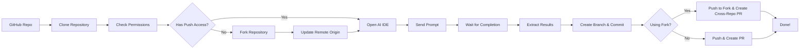

# SimulateDev

> Use cutting-edge AI IDEs such as Cursor and Windsurf as an API

SimulateDev is an automation tool that allows you to run AI coding agents (Cursor, Windsurf, Claude Code) on any GitHub repository with custom prompts, and automatically create pull requests with the changes. It supports both **single-agent** and **multi-agent collaborative workflows**.

## Features

- **Unified Architecture**: Single-agent and multi-agent workflows use the same execution engine
- **Multi-Agent Collaboration**: Planner → Coder → Tester workflows with specialized roles
- **Single-Agent Simplicity**: Quick tasks with just one AI agent
- **Multiple AI Agents**: Works with Cursor, Windsurf, Claude, and more
- **Automated Workflow**: Clone → Analyze → Implement → Test → Create PR
- **Custom Prompts**: Send any coding task to your preferred AI agent(s)
- **Visual UI Detection**: Uses Claude Computer Use for precise UI interaction
- **Auto Pull Requests**: Creates professional PRs with your changes
- **Local Execution**: Runs coding agents on your local machine

## How It Works



1. **Clone**: Downloads the specified GitHub repository
2. **Permission Check**: Automatically checks if you have push permissions
3. **Smart Workflow**: If no push access, automatically forks the repository
4. **Launch**: Opens your chosen AI coding agent (Cursor/Windsurf)
5. **Prompt**: Sends your custom coding task to the agent
6. **Monitor**: Watches the IDE interface to detect completion
7. **Commit**: Creates a new branch with the changes
8. **PR**: Creates pull request (cross-repository if using fork)

## Quick Start

### Prerequisites

- Python 3.8+
- Git installed and configured
- One of the supported AI IDEs installed:
  - [Cursor](https://cursor.com/)
  - [Windsurf](https://windsurf.ai/)
- API keys (see Setup section)

### Installation

Choose between local installation or Docker (recommended for easier setup):

#### Option 1: Docker (Recommended)

1. **Clone the repository:**
   ```bash
   git clone https://github.com/your-username/simulatedev.git
   cd simulatedev
   ```

2. **Set up environment variables:**
   ```bash
   cp env.example .env
   # Edit .env with your API keys
   ```

3. **Build and run with Docker:**
   ```bash
   # Build the image
   make build
   
   # Run a task
   make run TASK="Fix responsive design" REPO="https://github.com/user/repo"
   
   # Or use docker-compose directly
   docker-compose run --rm simulatedev python3 simulatedev.py \
     --task "Your coding task" \
     --repo https://github.com/user/repo \
     --workflow general_coding
   ```

See [DOCKER.md](DOCKER.md) for comprehensive Docker documentation.

#### Option 2: Local Installation

1. **Clone the repository:**
   ```bash
   git clone https://github.com/your-username/simulatedev.git
   cd simulatedev
   ```

2. **Install dependencies:**
   ```bash
   pip install -r requirements.txt
   ```

3. **Set up environment variables:**
   ```bash
   cp env.example .env
   # Edit .env with your API keys
   ```

4. **Configure your API keys in `.env`:**
   ```env
   ANTHROPIC_API_KEY=your_anthropic_key_here
   GITHUB_TOKEN=your_github_token_here  # Optional, for PR creation
   ```

### Basic Usage

SimulateDev provides a **unified CLI** that handles both single-agent and multi-agent workflows:

```bash
python simulatedev.py <task> <agent> --repo <repo_url>
```

### Single-Agent Tasks (Most Common)

For quick coding tasks with a single AI agent:

```bash
# Fix responsive design issues with Cursor
python simulatedev.py "Fix responsive table design for mobile devices" cursor --repo https://github.com/user/repo

# Add error handling with Windsurf  
python simulatedev.py "Add comprehensive error handling to API endpoints" windsurf --repo https://github.com/user/repo

# Custom optimization task
python simulatedev.py "Optimize database queries" claude --work-dir ./my-project

# Test the pipeline and analyze codebase consistency
python simulatedev.py "Analyze codebase for inconsistencies" test --repo https://github.com/user/repo --no-pr
```

### Multi-Agent Collaboration

For complex tasks requiring multiple specialized agents working together:

```bash
# Multi-agent mode
python simulatedev.py --multi task.json --repo https://github.com/user/repo --workflow general_coding

# Interactive mode
python simulatedev.py --multi --interactive

# From JSON string
python simulatedev.py --multi --json '{
  "coding_task_prompt": "Build a REST API with comprehensive tests",
  "agents": [
    {"coding_ide": "claude_code", "model": "Opus 4", "role": "Planner"},
    {"coding_ide": "cursor", "model": "N/A", "role": "Coder"},
    {"coding_ide": "windsurf", "model": "4", "role": "Tester"}
  ]
}' --repo https://github.com/user/repo --workflow general_coding
```

**Multi-Agent JSON Format:**
```json
{
  "coding_task_prompt": "Custom prompt (required only for general_coding workflow)",
  "agents": [
    {
      "coding_ide": "claude_code",
      "model": "Opus 4", 
      "role": "Planner"
    },
    {
      "coding_ide": "cursor",
      "model": "N/A",
      "role": "Coder"
    },
    {
      "coding_ide": "windsurf",
      "model": "4",
      "role": "Tester"
    }
  ]
}
```

**Key Fields:**
- `coding_task_prompt`: Custom task description (required only for `general_coding` workflow)

**Command-Line Parameters:**
- `--repo`: Repository URL to work on
- `--workflow`: Optional predefined workflow (`bug_hunting`, `code_optimization`, `general_coding`)

**Supported Roles:**
- **Planner**: Creates implementation plans and breaks down complex tasks
- **Coder**: Implements the solution based on the plan
- **Tester**: Tests and validates the implementation

### Workflow System

SimulateDev now supports predefined workflows that can be specified in JSON:

| Workflow | Description | Use Case |
|----------|-------------|----------|
| `bug_hunting` | Find and fix security vulnerabilities and bugs | Security audits, bug fixes |
| `code_optimization` | Performance optimizations and improvements | Speed improvements, refactoring |
| `general_coding` | Custom coding tasks with your own prompt | Any development task |

**Example with Workflow:**
```json
{
  "agents": [
    {
      "coding_ide": "cursor",
      "model": "claude-sonnet-4",
      "role": "Coder"
    }
  ]
}
```

**Usage:**
```bash
python simulatedev.py --multi task.json --repo https://github.com/user/webapp --workflow bug_hunting
```

Note: For `bug_hunting` and `code_optimization` workflows, no `coding_task_prompt` is needed as the task is predefined.

See [WORKFLOW_EXAMPLES.md](WORKFLOW_EXAMPLES.md) for comprehensive examples.

### Specialized Workflows

For predefined specialized workflows, use the workflows CLI:

```bash
python workflows_cli.py <workflow> <repo_url> <agent>
```

**Available Workflows:**

| Workflow | Description | Example |
|----------|-------------|---------|
| `bugs` | Find and fix bugs and security issues | `python workflows_cli.py bugs https://github.com/user/repo cursor` |
| `optimize` | Performance optimizations and improvements | `python workflows_cli.py optimize https://github.com/user/repo windsurf` |
| `refactor` | Code quality improvements and refactoring | `python workflows_cli.py refactor https://github.com/user/repo cursor` |
| `low-hanging` | Quick wins and easy improvements | `python workflows_cli.py low-hanging https://github.com/user/repo windsurf` |

**Examples:**

```bash
# Hunt for bugs and security issues
python workflows_cli.py bugs https://github.com/user/repo cursor

# Find performance optimization opportunities  
python workflows_cli.py optimize https://github.com/user/repo windsurf

# Improve code quality and maintainability
python workflows_cli.py refactor https://github.com/user/repo cursor

# Find easy wins and quick improvements
python workflows_cli.py low-hanging https://github.com/user/repo windsurf

# Skip pull request creation
python workflows_cli.py bugs https://github.com/user/repo cursor --no-pr
```

## Configuration

### Environment Variables

All configuration is managed through environment variables in your `.env` file:

**🎉 New Feature**: When you provide a `GITHUB_TOKEN`, SimulateDev can automatically detect your GitHub username and email! You can still override these by setting `GIT_USER_NAME` and `GIT_USER_EMAIL` if needed.

| Variable | Purpose | Required | Default | Notes |
|----------|---------|----------|---------|-------|
| `ANTHROPIC_API_KEY` | UI element detection and IDE state analysis | Yes | - | [Get key](https://console.anthropic.com/) |
| `GITHUB_TOKEN` | Pull request creation | Optional | - | [Get token](https://github.com/settings/tokens) |
| `AGENT_TIMEOUT_SECONDS` | Agent execution timeout | Optional | 600 | 30-7200 seconds (0.5-120 minutes) |
| `GIT_USER_NAME` | Git commit author | Optional | Auto-detected from GitHub | Set to override GitHub account name |
| `GIT_USER_EMAIL` | Git commit email | Optional | Auto-detected from GitHub | Set to override GitHub account email |

### Timeout Configuration

The `AGENT_TIMEOUT_SECONDS` setting controls how long SimulateDev waits for agents to complete tasks:

```env
# Default: 10 minutes (good for most tasks)
AGENT_TIMEOUT_SECONDS=600

# For complex tasks: 20 minutes
AGENT_TIMEOUT_SECONDS=1200

# For simple tasks: 5 minutes  
AGENT_TIMEOUT_SECONDS=300

# Maximum: 2 hours
AGENT_TIMEOUT_SECONDS=7200
```

**Guidelines:**
- **Simple tasks** (bug fixes, small features): 300-600 seconds (5-10 minutes)
- **Medium tasks** (refactoring, optimizations): 600-1200 seconds (10-20 minutes)  
- **Complex tasks** (large features, major changes): 1200-3600 seconds (20-60 minutes)
- **Very complex tasks**: Up to 7200 seconds (2 hours)

The timeout is automatically validated and clamped to reasonable bounds (30 seconds minimum, 2 hours maximum).

### Supported AI Agents

| Agent | Status | Notes |
|-------|--------|-------|
| Cursor | Supported | Full integration |
| Windsurf | Supported | Full integration |  
| Claude Code | Coming Soon | In development |
| Test | Supported | Pipeline testing & codebase analysis |

## Advanced Usage

### Smart Permission Handling

SimulateDev automatically handles repository permissions for you:

**Case 1: You have push permissions**
- Works directly on the original repository
- Creates branches and pull requests normally
- Fastest workflow, no forking needed

**Case 2: You don't have push permissions** 
- Automatically forks the repository to your GitHub account
- Makes changes in your fork
- Creates a cross-repository pull request from your fork to the original repo
- Completely transparent - you don't need to do anything different!

```bash
# Same command works for both cases
python simulatedev.py "Fix bug" cursor --repo https://github.com/someone-else/repo
```

The tool will automatically:
1. Check your permissions on the target repository
2. Fork it if needed (only once - reuses existing forks)
3. Update git remotes to point to your fork
4. Create pull request from your fork back to the original repository

### Custom Target Directory

```bash
python simulatedev.py "Fix bugs" cursor --repo https://github.com/user/repo --target-dir ~/my-projects/repo
```

### Skip Pull Request Creation

```bash
python simulatedev.py "Add features" windsurf --repo https://github.com/user/repo --no-pr
```

### Test Agent

The Test Agent is a special agent designed for pipeline testing and codebase analysis. Unlike other agents that require UI interaction, the Test Agent performs automated analysis and is perfect for:

- **Pipeline Testing**: Verify that the entire SimulateDev pipeline works correctly
- **Codebase Analysis**: Identify inconsistencies in code structure and documentation
- **README Validation**: Check if documentation accurately reflects the current codebase
- **Quality Assurance**: Find missing headers, documentation, and registration issues

**Usage:**
```bash
# Run codebase analysis
python simulatedev.py "Analyze codebase for inconsistencies" test --repo https://github.com/user/repo

# Test the pipeline without creating a PR
python simulatedev.py "Test pipeline functionality" test --repo https://github.com/user/repo --no-pr
```

The Test Agent automatically checks for:
- Agent registration consistency in factory files
- README accuracy compared to available agents
- Missing file headers and documentation
- General code structure issues

### Environment Variables

You can also set environment variables directly:

```bash
export ANTHROPIC_API_KEY="your_key"
export GITHUB_TOKEN="your_token"
python simulatedev.py "Refactor code" cursor --repo https://github.com/user/repo
```

## Development

### Project Structure

```
simulatedev/
├── simulatedev.py               # Main unified CLI for all workflows
├── src/                         # Core application modules
│   ├── __init__.py             # Package initialization
│   ├── unified_orchestrator.py # Unified orchestration for single/multi-agent workflows
│   ├── multi_agent_orchestrator.py # Legacy multi-agent orchestrator (uses role system)
│   ├── agent_orchestrator.py   # High-level agent workflow coordination
│   ├── workflows_cli.py        # CLI for specialized workflows (bugs, optimize, etc.)
│   └── github_integration.py   # GitHub API operations and PR creation
├── utils/                       # Utility functions and helper scripts
│   ├── __init__.py             # Package initialization
│   ├── clone_repo.py           # Repository cloning utilities
│   ├── computer_use_utils.py   # Claude Computer Use integration
│   └── ide_completion_detector.py # IDE state monitoring
├── agents/                      # AI agent implementations
│   ├── __init__.py             # Package initialization
│   ├── base.py                 # Base agent classes
│   ├── cursor_agent.py         # Cursor IDE integration
│   ├── windsurf_agent.py       # Windsurf IDE integration
│   ├── claude_code_agent.py    # Claude Code integration
│   ├── test_agent.py           # Testing and analysis agent
│   └── factory.py              # Agent creation and management
├── roles/                       # Role-based agent system
│   ├── __init__.py             # Package initialization
│   ├── base_role.py            # Abstract base role class
│   ├── planner_role.py         # Planning and task breakdown
│   ├── coder_role.py           # Code implementation
│   ├── tester_role.py          # Testing and validation
│   └── role_factory.py         # Role creation and management
├── workflows/                   # Specialized workflow modules
│   ├── __init__.py             # Package initialization
│   ├── bug_hunting.py          # Bug discovery and fixing workflows
│   ├── code_optimization.py    # Performance and refactoring workflows
│   └── general_coding.py       # General user-defined coding tasks
├── common/                      # Shared utilities and configuration
│   ├── __init__.py             # Package initialization
│   ├── config.py               # Configuration management
│   └── exceptions.py           # Custom exception classes
├── examples/                    # Sample configuration files
│   ├── __init__.py             # Package initialization
│   ├── README.md               # Examples documentation
│   ├── sample_bug_hunting_task.json      # Bug hunting example
│   ├── sample_multi_agent_task.json      # Multi-agent example
│   └── sample_optimization_task.json     # Code optimization example
├── docs/                        # Documentation files
│   ├── __init__.py             # Package initialization
│   └── WORKFLOW_EXAMPLES.md    # Comprehensive workflow examples
├── coding_agents.py            # Backward compatibility layer
├── requirements.txt            # Dependencies
└── execution_output/          # All execution files and outputs
    ├── scanned_repos/         # Cloned repositories
    └── reports/               # Agent execution reports
```

### Architecture

SimulateDev uses a **unified architecture** where single-agent workflows are treated as multi-agent workflows with one coder agent:

```
Unified CLI → Unified Orchestrator → Role System → Agent Factory
```

**Key Components:**
- **Unified CLI** (`simulatedev.py`): Single entry point for all workflows
- **Unified Orchestrator**: Handles both single and multi-agent execution
- **Role System**: Specialized behavior for Planner, Coder, and Tester roles
- **Agent Factory**: Creates and manages different AI agents

This design provides:
- **Code Unification**: ~60% reduction in orchestration code
- **Maintainability**: Single source of truth for orchestration logic
- **Consistency**: Same experience across all workflow types
- **Extensibility**: Foundation for future enhancements

## Contributing

1. Fork the repository
2. Create a feature branch
3. Make your changes
4. Add tests if applicable
5. Submit a pull request

## License

This project is licensed under the MIT License - see the [LICENSE](LICENSE) file for details.

## Support

If you encounter any issues or have questions:

1. Check the documentation above
2. Look at existing issues on GitHub
3. Create a new issue with detailed information about your problem

## Roadmap

- [ ] Claude Code agent integration
- [ ] Parallel multi-agent execution
- [ ] Custom role definitions
- [ ] Web interface
- [ ] Integration with more IDEs
