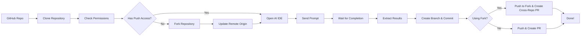

# SimulateDev
Run cutting-edge AI coding IDEs such as Cursor, Devin, and Claude Code via code.

SimulateDev is an automation tool that runs AI coding agents (Cursor, Devin, Claude Code) on any GitHub repository with custom prompts and automatically creates pull requests with the changes. It supports both **single-agent** and **multi-agent collaborative workflows**. SimulateDev can also help you automatically address reviewer comments on existing PRs or completely resolve open GitHub issues.

For additional scripts and utilities, see the [scripts directory](scripts/README.md).


https://github.com/user-attachments/assets/13b35289-3f38-4a46-a176-9c8e85892fe9

👆 This video shows how SimulateDev addresses an [open issue](https://github.com/tavily-ai/tavily-python/issues/93) in Tavily's Python repository, submitting a [pull request](https://github.com/tavily-ai/tavily-python/pull/118) to solve it.


## ⚠️ Important Notes

- macOS only: SimulateDev currently only works on macOS. Windows and Linux support are planned for future releases.
- Ensure your coding IDEs (Cursor, Windsurf, Claude Code) are already installed and ready to use - SimulateDev doesn't handle IDE setup or installation (for now)
- For Windsurf users: Turn on **Turbo mode** for terminal auto-execution to ensure commands run automatically. [Learn more](https://www.reddit.com/r/windsurf/comments/1kksxgh/comment/mrx2el2/)
- SimulateDev will periodically bring the IDE to the front to monitor the coding agent's progress and state. Ideally: you take your coffee break and let it work :)
- **Permissions Required**: GitHub token needs `repo` permissions. Cursor/Windsurf require Automation & Accessibility permissions in System Settings → Privacy & Security

## Run SimulateDev in <1 min
Clone this repo → Create virtual environment → Install requirements.txt → Copy .env.example into .env and replace API keys → Run the following command (replace to your coding IDE of choice and GitHub repo url):
```bash
python simulatedev.py --workflow bugs --repo https://github.com/saharmor/gemini-multimodal-playground --agent cursor
```


## Features

- **Multi-Agent Collaboration**: Planner → Coder → Tester workflows with specialized roles
- **Multiple Coding IDEs/Agents**: Works with Cursor, Windsurf, Claude, and more (future: Devin, Factory, Codex)
- **Automated Workflow**: Clone → Analyze → Implement → Test → Create PR
- **Custom Prompts**: Send any coding task to your preferred AI agent(s)
- **Visual UI Detection**: Uses Claude Computer Use for precise UI interaction
- **Local Execution**: Runs coding agents on your local machine (future: cloud execution)

## How It Works



1. **Clone**: Downloads the specified GitHub repository
2. **Smart Workflow**: If no push access, automatically forks the repository
3. **Launch**: Opens your chosen AI coding agent (Cursor/Windsurf/etc.)
4. **Prompt**: Sends your custom coding task to the agent
5. **Monitor**: Watches the IDE interface to detect completion
6. **Commit**: Creates a new branch with the changes
7. **PR**: Creates pull request

## How SimulateDev Operates

SimulateDev runs **entirely on your local machine** and leverages your existing AI coding IDEs (Cursor, Windsurf, Claude Code) to execute both single-agent and multi-agent collaborative workflows. Here's how it works under the hood:

- **Multi-Agent Orchestration**: Supports collaborative workflows where specialized agents (Planner → Coder → Tester) work together sequentially on complex tasks
- **IDE Integration**: SimulateDev programmatically opens and controls your installed coding IDEs through:
  - **GUI Automation**: Uses keyboard shortcuts and UI interaction for Cursor and Windsurf
- **Screen Analysis**: Uses vision models (e.g. Claude) to analyze IDE screenshots and detect task completion, progress, and UI states
- **Intelligent Monitoring**: Continuously monitors IDE interfaces with adaptive check intervals, automatic resume detection, and timeout management
- **Window Focus Management**: For GUI-based IDEs like Cursor, the window must be **visible and focused**. SimulateDev will play a beep sound and pause execution if the IDE window loses focus

**Important**: For Cursor and Windsurf, keep the IDE window visible and focused during execution. Claude Code runs headlessly and doesn't require window focus.

## Quick Start

### Prerequisites

- **macOS** (SimulateDev currently only works on Mac)
- Python 3.8+
- Git installed and configured
- One of the supported AI IDEs installed:
  - [Cursor](https://cursor.com/)
  - [Windsurf](https://windsurf.ai/)
  - Claude Code
- **IDE Setup**: Your chosen coding IDE must be properly installed and configured (logged in, authenticated, ready to use) before running SimulateDev
- API keys (see [Configuration](https://github.com/saharmor/simulatedev#configuration) section)

### Installation

1. **Clone the repository:**
   ```bash
   git clone https://github.com/saharmor/simulatedev.git
   cd simulatedev
   ```

2. **Create and activate a virtual environment (recommended):**
   ```bash
   # Create virtual environment
   python -m venv venv
   
   # Activate virtual environment
   source venv/bin/activate  # On macOS/Linux
   # or
   venv\Scripts\activate     # On Windows
   ```

3. **Install dependencies:**
   ```bash
   pip install -r requirements.txt
   ```

4. **Set up environment variables:**
   ```bash
   cp env.example .env
   # Edit .env with your API keys
   ```

5. **Configure your API keys in `.env`:**
   ```env
   ANTHROPIC_API_KEY=your_anthropic_key_here
   GITHUB_TOKEN=your_github_token_here  # Optional, for PR creation
   ```

### 🌐 Web Interface (Recommended)

For the easiest way to get started, use the **interactive web interface** to generate CLI commands:

```bash
open simulatedev_ui.html
```

The web interface provides:
- **Easy Configuration**: Visual forms for all settings and options
- **Step-by-Step Guide**: Clear instructions for each step
- **Command Generation**: Automatically generates the correct CLI command
- **Multi-Agent Setup**: Simple interface for complex multi-agent workflows


## Usage

SimulateDev offers three main ways to run coding tasks:

### 1. 🚀 Quick Start with Predefined Workflows (Recommended)

Use built-in workflows for common coding tasks - no custom prompts needed:

```bash
python simulatedev.py --workflow <workflow_name> --repo <repo_url> --agent <agent_name>
```

**Available Workflows:**

| Workflow | Description | When to Use |
|----------|-------------|-------------|
| `bugs` | Find and fix bugs and security issues | Code has known issues or needs security audit |
| `optimize` | Performance optimizations and improvements | App is slow or needs better performance |
| `refactor` | Code quality improvements and refactoring | Code works but needs better structure/maintainability |
| `low-hanging` | Quick wins and easy improvements | Want fast, low-risk improvements |
| `custom` | Custom coding tasks with your own prompt | Need specific functionality or have custom requirements (see [Custom Single-Agent Tasks](#-custom-single-agent-tasks) section below) |


**Examples:**
```bash
# Hunt for bugs and security issues
python simulatedev.py --workflow bugs --repo https://github.com/user/repo --agent cursor

# Find performance optimization opportunities  
python simulatedev.py --workflow optimize --repo https://github.com/user/repo --agent windsurf

# Improve code quality and maintainability
python simulatedev.py --workflow refactor --repo https://github.com/user/repo --agent cursor

# Find easy wins and quick improvements
python simulatedev.py --workflow low-hanging --repo https://github.com/user/repo --agent windsurf
```

### 2. 🎯 Custom Single-Agent Tasks

For specific coding tasks with your own custom coding prompt:

```bash
python simulatedev.py --workflow custom --task "<your_custom_task>" --repo <repo_url> --agent <agent_name>
```

**Examples:**
```bash
# Fix responsive design issues with Cursor
python simulatedev.py --workflow custom --task "Fix responsive table design for mobile devices" --repo https://github.com/user/repo --agent cursor

# Add error handling with Windsurf  
python simulatedev.py --workflow custom --task "Add comprehensive error handling to API endpoints" --repo https://github.com/user/repo --agent windsurf

# Custom analysis task
python simulatedev.py --workflow custom --task "Analyze codebase for inconsistencies and create a report" --repo https://github.com/user/repo --agent cursor
```

### 3. 🤝 Multi-Agent Collaboration

For complex tasks requiring multiple specialized agents working together:

```bash
# Multi-agent custom coding with inline JSON
python simulatedev.py --workflow custom --task "<your_custom_task>" --repo <repo_url> --coding-agents '<json_config>'
```

**Multi-Agent JSON Format:**
```json
[
  {"coding_ide": "claude_code", "model": "claude-4-sonnet", "role": "Planner"},
  {"coding_ide": "cursor", "model": "claude-4-sonnet", "role": "Coder"},
  {"coding_ide": "windsurf", "model": "claude-4-sonnet", "role": "Tester"}
]
```

**Supported Roles:**
- **Planner**: Creates implementation plans and breaks down complex tasks
- **Coder**: Implements the solution based on the plan
- **Tester**: Tests and validates the implementation

**Example:**
```bash
python simulatedev.py --workflow custom --task "Find one critical bug and fix it" --repo https://github.com/browserbase/stagehand --coding-agents '[
  {"coding_ide": "cursor", "model": "claude-4-sonnet", "role": "Coder"},
  {"coding_ide": "windsurf", "model": "claude-4-sonnet", "role": "Tester"}
]'
```

### Additional Options

```bash
# Skip pull request creation (testing only)
python simulatedev.py --workflow bugs --repo https://github.com/user/repo --agent cursor --no-pr

# Keep existing repository directory (don't delete before cloning)
python simulatedev.py --workflow bugs --repo https://github.com/user/repo --agent cursor --no-delete-existing-repo-env
```

## Scripts

SimulateDev includes specialized scripts for GitHub workflow automation:

### Issue to Task (`scripts/issue_to_task.py`)
Automatically converts GitHub issues into pull requests with fixes. Analyzes issue content, comments, and labels to generate comprehensive solutions.

```bash
# Address a GitHub issue automatically
python scripts/issue_to_task.py --issue-url https://github.com/owner/repo/issues/123 --agent cursor

# Multi-agent issue resolution
python scripts/issue_to_task.py --issue-url https://github.com/owner/repo/issues/123 \
  --coding-agents '[{"coding_ide":"cursor","model":"Claude Sonnet 3.5","role":"Planner"},{"coding_ide":"windsurf","model":"Claude Sonnet 3.5","role":"Coder"}]'
```

### PR to Task (`scripts/pr_to_task.py`)
Processes existing pull requests to automatically addresses all reviewer comments and feedback.

```bash
# Address all PR review comments automatically
python scripts/pr_to_task.py --pr-url https://github.com/owner/repo/pull/456 --review-comments --agent cursor
```

Both scripts support all SimulateDev agents and can work with private repositories when properly configured with GitHub tokens.

## Configuration

### Environment Variables

All configuration is managed through environment variables in your `.env` file:

| Variable | Purpose | Required | Default | Notes |
|----------|---------|----------|---------|-------|
| `ANTHROPIC_API_KEY` | UI element detection and IDE state analysis | Yes | - | [Get key](https://console.anthropic.com/) |
| `GITHUB_TOKEN` | Pull request creation | Optional | - | [Get token](https://github.com/settings/tokens) |
| `AGENT_TIMEOUT_SECONDS` | Agent execution timeout | Optional | 600 | 30-7200 seconds (0.5-120 minutes) |
| `GIT_USER_NAME` | Git commit author | Optional | Auto-detected from GitHub | Set to override GitHub account name |
| `GIT_USER_EMAIL` | Git commit email | Optional | Auto-detected from GitHub | Set to override GitHub account email |


### Timeout Configuration

The `AGENT_TIMEOUT_SECONDS` setting controls how long SimulateDev waits for agents to complete tasks:

**Guidelines:**
- **Simple tasks** (bug fixes, small features): 300-600 seconds (5-10 minutes)
- **Medium tasks** (refactoring, optimizations): 600-1200 seconds (10-20 minutes)  
- **Complex tasks** (large features, major changes): 1200-3600 seconds (20-60 minutes)
- **Very complex tasks**: Up to 7200 seconds (2 hours)

The timeout is automatically validated and clamped to reasonable bounds (30 seconds minimum, 2 hours maximum).

### Supported AI Agents

| Agent | Status | Notes |
|-------|--------|-------|
| Cursor | Supported | Full integration |
| Windsurf | Supported | Full integration |  
| Claude Code | Supported (Headless) | Full integration |


## Troubleshooting

### Common Issues and Solutions

#### Input Field Detection Issues
If Claude cannot locate the IDE's input field, SimulateDev will:
- **Play a beep sound** to alert you
- **Retry the operation** after you address the issue
- **Provide clear error messages** about what went wrong

**Common causes**:
- IDE interface has changed or is in an unexpected state
- Wrong IDE window is focused
- IDE is not fully loaded or ready

#### Timeout Configuration
If tasks are timing out, adjust the timeout in your `.env` file:
```env
# Increase timeout for complex tasks (in seconds)
AGENT_TIMEOUT_SECONDS=3600  # 1 hour
```

#### Repository Access Issues
If you see "Failed to clone repository" errors:
- Check that the repository URL is correct and accessible
- By default, existing repository directories are deleted before cloning (use `--no-delete-existing-repo-env` to keep existing directories)
- Ensure you have proper GitHub access permissions

### Error Handling Improvements
SimulateDev now provides consistent error handling across all scenarios:
- **Beep sounds** for attention-requiring issues
- **Clear error messages** with specific guidance
- **Automatic retries** for transient issues
- **Graceful degradation** when possible

## License

This project is licensed under the MIT License - see the [LICENSE](LICENSE) file for details.

## Roadmap

- [ ] Add web agents (Devin, Factory, Codex)
- [ ] Cloud execution (Daytona, E2B)
- [ ] Live monitoring of coding task
- [ ] Budgeting tools for better spend control
