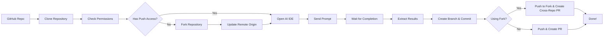

# SimulateDev

> Use cutting-edge AI IDEs such as Cursor and Windsurf as an API

SimulateDev is an automation tool that allows you to run AI coding agents (Cursor, Windsurf, Claude Code) on any GitHub repository with a custom prompt, and automatically create pull requests with the changes.

## Features

- **Multi-Agent Support**: Works with Cursor, Windsurf, and Claude Code (coming soon)
- **Automated Workflow**: Clone → Analyze → Implement → Create PR
- **Custom Prompts**: Send any coding task to your preferred AI agent
- **Visual UI Detection**: Uses Claude Computer Use for precise UI interaction
- **Auto Pull Requests**: Creates professional PRs with your changes
- **Local Execution**: Runs coding agents on your local machine

## How It Works



1. **Clone**: Downloads the specified GitHub repository
2. **Permission Check**: Automatically checks if you have push permissions
3. **Smart Workflow**: If no push access, automatically forks the repository
4. **Launch**: Opens your chosen AI coding agent (Cursor/Windsurf)
5. **Prompt**: Sends your custom coding task to the agent
6. **Monitor**: Watches the IDE interface to detect completion
7. **Commit**: Creates a new branch with the changes
8. **PR**: Creates pull request (cross-repository if using fork)

## Quick Start

### Prerequisites

- Python 3.8+
- Git installed and configured
- One of the supported AI IDEs installed:
  - [Cursor](https://cursor.com/)
  - [Windsurf](https://windsurf.ai/)
- API keys (see Setup section)

### Installation

1. **Clone the repository:**
   ```bash
   git clone https://github.com/your-username/simulatedev.git
   cd simulatedev
   ```

2. **Install dependencies:**
   ```bash
   pip install -r requirements.txt
   ```

3. **Set up environment variables:**
   ```bash
   cp env.example .env
   # Edit .env with your API keys
   ```

4. **Configure your API keys in `.env`:**
   ```env
   ANTHROPIC_API_KEY=your_anthropic_key_here
   GOOGLE_API_KEY=your_google_key_here
   GITHUB_TOKEN=your_github_token_here  # Optional, for PR creation
   ```

### Basic Usage

```bash
python main.py <repo_url> <prompt> <agent>
```

**Examples:**

```bash
# Fix responsive design issues with Cursor
python main.py https://github.com/user/repo "Fix responsive table design for mobile devices" cursor

# Add error handling with Windsurf
python main.py https://github.com/user/repo "Add comprehensive error handling to API endpoints" windsurf

# Optimize with Claude Code
python main.py https://github.com/user/repo "Optimize database queries" claude_code

# Skip pull request creation
python main.py https://github.com/user/repo "Optimize database queries" cursor --no-pr
```

## Configuration

### API Keys Required

| Service | Purpose | Required | Get Key |
|---------|---------|----------|---------|
| Anthropic Claude | UI element detection | Yes | [Console](https://console.anthropic.com/) |  
| Google Gemini | IDE state analysis | Yes | [AI Studio](https://ai.google.dev/) |
| GitHub | Pull request creation | Optional | [Settings](https://github.com/settings/tokens) |

### Supported AI Agents

| Agent | Status | Notes |
|-------|--------|-------|
| Cursor | Supported | Full integration |
| Windsurf | Supported | Full integration |  
| Claude Code | Coming Soon | In development |

## Advanced Usage

### Smart Permission Handling

SimulateDev automatically handles repository permissions for you:

**Case 1: You have push permissions**
- Works directly on the original repository
- Creates branches and pull requests normally
- Fastest workflow, no forking needed

**Case 2: You don't have push permissions** 
- Automatically forks the repository to your GitHub account
- Makes changes in your fork
- Creates a cross-repository pull request from your fork to the original repo
- Completely transparent - you don't need to do anything different!

```bash
# Same command works for both cases
python main.py https://github.com/someone-else/repo "Fix bug" cursor
```

The tool will automatically:
1. Check your permissions on the target repository
2. Fork it if needed (only once - reuses existing forks)
3. Update git remotes to point to your fork
4. Create pull request from your fork back to the original repository

### Custom Target Directory

```bash
python main.py https://github.com/user/repo "Fix bugs" cursor --target-dir ~/my-projects/repo
```

### Skip Pull Request Creation

```bash
python main.py https://github.com/user/repo "Add features" windsurf --no-pr
```

### Environment Variables

You can also set environment variables directly:

```bash
export ANTHROPIC_API_KEY="your_key"
export GOOGLE_API_KEY="your_key" 
export GITHUB_TOKEN="your_token"
python main.py https://github.com/user/repo "Refactor code" cursor
```

## Development

### Project Structure

```
simulatedev/
├── main.py                    # Main orchestrator
├── bug_hunter.py             # IDE interaction logic
├── clone_repo.py             # Repository cloning
├── computer_use_utils.py     # Claude Computer Use integration
├── ide_completion_detector.py # IDE state monitoring
├── github_integration.py     # GitHub API operations
├── requirements.txt          # Dependencies
└── scanned_repos/           # Cloned repositories
```

### Running Tests

```bash
# Test GitHub integration
python github_integration.py

# Test repository cloning
python clone_repo.py https://github.com/octocat/Hello-World

# Test computer use utilities
python computer_use_utils.py
```

## Contributing

1. Fork the repository
2. Create a feature branch: `git checkout -b feature/amazing-feature`
3. Commit your changes: `git commit -m 'Add amazing feature'`
4. Push to the branch: `git push origin feature/amazing-feature`
5. Open a Pull Request

## Roadmap

- [ ] **Claude Code Integration**: Add support for Google Cloud Code
- [ ] **Web Interface**: Build a web UI for easier usage
- [ ] **Batch Processing**: Process multiple repositories at once
- [ ] **Custom Agents**: Support for other AI coding tools
- [ ] **Docker Support**: Containerized execution
- [ ] **Webhooks**: GitHub webhook integration for automated triggers

## Troubleshooting

### Common Issues

**IDE doesn't open:**
- Ensure the IDE is installed and accessible from command line
- Check if the IDE is already running

**API key errors:**
- Verify your API keys in `.env` file
- Check API key permissions and quotas

**Pull request creation fails:**
- Ensure GitHub token has `repo` permissions
- For private repositories, token needs additional permissions
- If forking fails, check if the repository allows forking

**Permission issues:**
- If you don't have push permissions, the tool will automatically fork
- Ensure your GitHub token has `public_repo` permission (for public repos) or `repo` (for private repos)
- For organizations, you may need additional permissions to fork repositories

**UI element not found:**
- Try running with a clean IDE state
- Ensure the IDE window is visible and focused

## License

This project is licensed under the MIT License - see the [LICENSE](LICENSE) file for details.

## Acknowledgments

- [Anthropic Claude](https://anthropic.com/) for computer use capabilities
- [Google Gemini](https://ai.google.dev/) for image analysis
- [Cursor](https://cursor.com/) and [Windsurf](https://windsurf.ai/) for amazing AI coding experiences

---

**Built with love for the developer community**
