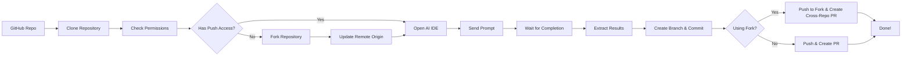

# SimulateDev
Run cutting-edge AI coding IDEs such as Cursor, Devin, and Claude Code via code

SimulateDev is an automation tool that allows you to run AI coding agents (Cursor, Devin, Claude Code) on any GitHub repository with custom prompts, and automatically create pull requests with the changes. It supports both **single-agent** and **multi-agent collaborative workflows**.

## Features

- **Multi-Agent Collaboration**: Planner → Coder → Tester workflows with specialized roles
- **Multiple Coding IDEs/Agents**: Works with Cursor, Windsurf, Claude, and more (future: Devin, Factory, Codex)
- **Automated Workflow**: Clone → Analyze → Implement → Test → Create PR
- **Custom Prompts**: Send any coding task to your preferred AI agent(s)
- **Visual UI Detection**: Uses Claude Computer Use for precise UI interaction
- **Local Execution**: Runs coding agents on your local machine (future: cloud execution)

## How It Works



1. **Clone**: Downloads the specified GitHub repository
2. **Smart Workflow**: If no push access, automatically forks the repository
3. **Launch**: Opens your chosen AI coding agent (Cursor/Windsurf/etc.)
4. **Prompt**: Sends your custom coding task to the agent
5. **Monitor**: Watches the IDE interface to detect completion
6. **Commit**: Creates a new branch with the changes
7. **PR**: Creates pull request

## Quick Start

### Prerequisites

- Python 3.8+
- Git installed and configured
- One of the supported AI IDEs installed:
  - [Cursor](https://cursor.com/)
  - [Windsurf](https://windsurf.ai/)
- API keys (see Setup section)

### Installation

1. **Clone the repository:**
   ```bash
   git clone https://github.com/your-username/simulatedev.git
   cd simulatedev
   ```

2. **Install dependencies:**
   ```bash
   pip install -r requirements.txt
   ```

3. **Set up environment variables:**
   ```bash
   cp env.example .env
   # Edit .env with your API keys
   ```

4. **Configure your API keys in `.env`:**
   ```env
   ANTHROPIC_API_KEY=your_anthropic_key_here
   GITHUB_TOKEN=your_github_token_here  # Optional, for PR creation
   ```

### 🌐 Web Interface (Recommended)

For the easiest way to get started, use the **interactive web interface** to generate CLI commands:

```bash
# Open the web interface in your browser
open simulatedev_ui.html
```

The web interface provides:
- **Easy Configuration**: Visual forms for all settings and options
- **Step-by-Step Guide**: Clear instructions for each step
- **Command Generation**: Automatically generates the correct CLI command
- **Multi-Agent Setup**: Simple interface for complex multi-agent workflows
- **Built-in Help**: Tooltips and explanations for all options

**Perfect for:**
- First-time users getting familiar with SimulateDev
- Complex multi-agent configurations
- Quick command generation without memorizing syntax

### Basic Usage

SimulateDev provides a **unified CLI** that handles both single-agent and multi-agent workflows:

```bash
python simulatedev.py <task> <agent> --repo <repo_url>
```

### Single-Agent Tasks (Most Common)

For quick coding tasks with a single AI agent:

```bash
# Fix responsive design issues with Cursor
python simulatedev.py "Fix responsive table design for mobile devices" cursor --repo https://github.com/user/repo

# Add error handling with Windsurf  
python simulatedev.py "Add comprehensive error handling to API endpoints" windsurf --repo https://github.com/user/repo

# Test the pipeline and analyze codebase consistency
python simulatedev.py "Analyze codebase for inconsistencies" test --repo https://github.com/user/repo
```

### Multi-Agent Collaboration

For complex tasks requiring multiple specialized agents working together:

```bash
# Multi-agent mode
python simulatedev.py --multi task.json --repo https://github.com/user/repo --workflow custom_coding

# Interactive mode
python simulatedev.py --multi --interactive

# From JSON string
python simulatedev.py --multi --json '{
  "coding_task_prompt": "Add support for Firefox browser automation",
  "agents": [
    {"coding_ide": "claude_code", "model": "claude-opus-4", "role": "Planner"},
    {"coding_ide": "cursor", "model": "claude-sonnet-4", "role": "Coder"},
    {"coding_ide": "windsurf", "model": "claude-sonnet-4", "role": "Tester"}
  ]
}' --repo https://github.com/browserbase/stagehand --workflow custom_coding
```

**Multi-Agent JSON Format:**

**Key Fields:**
- `coding_task_prompt`: Custom task description (required only for `custom_coding` workflow)

**Command-Line Parameters:**
- `--repo`: Repository URL to work on
- `--workflow`: Optional predefined workflow (`bug_hunting`, `code_optimization`, `custom_coding`)

**Supported Roles:**
- **Planner**: Creates implementation plans and breaks down complex tasks
- **Coder**: Implements the solution based on the plan
- **Tester**: Tests and validates the implementation

### Workflow System

SimulateDev supports predefined workflows that can be specified in JSON:

| Workflow | Description | Example |
|----------|-------------|---------|
| `bugs` | Find and fix bugs and security issues | `python workflows_cli.py bugs https://github.com/user/repo cursor` |
| `optimize` | Performance optimizations and improvements | `python workflows_cli.py optimize https://github.com/user/repo windsurf` |
| `refactor` | Code quality improvements and refactoring | `python workflows_cli.py refactor https://github.com/user/repo cursor` |
| `low-hanging` | Quick wins and easy improvements | `python workflows_cli.py low-hanging https://github.com/user/repo windsurf` |


See [WORKFLOW_EXAMPLES.md](WORKFLOW_EXAMPLES.md) for comprehensive examples.


**Examples:**

```bash
# Hunt for bugs and security issues
python workflows_cli.py bugs https://github.com/user/repo cursor

# Find performance optimization opportunities  
python workflows_cli.py optimize https://github.com/user/repo windsurf

# Improve code quality and maintainability
python workflows_cli.py refactor https://github.com/user/repo cursor

# Find easy wins and quick improvements
python workflows_cli.py low-hanging https://github.com/user/repo windsurf

# Skip pull request creation
python workflows_cli.py bugs https://github.com/user/repo cursor --no-pr
```

## Configuration

### Environment Variables

All configuration is managed through environment variables in your `.env` file:

| Variable | Purpose | Required | Default | Notes |
|----------|---------|----------|---------|-------|
| `ANTHROPIC_API_KEY` | UI element detection and IDE state analysis | Yes | - | [Get key](https://console.anthropic.com/) |
| `GITHUB_TOKEN` | Pull request creation | Optional | - | [Get token](https://github.com/settings/tokens) |
| `AGENT_TIMEOUT_SECONDS` | Agent execution timeout | Optional | 600 | 30-7200 seconds (0.5-120 minutes) |
| `GIT_USER_NAME` | Git commit author | Optional | Auto-detected from GitHub | Set to override GitHub account name |
| `GIT_USER_EMAIL` | Git commit email | Optional | Auto-detected from GitHub | Set to override GitHub account email |

### Git Configuration Behavior

SimulateDev now provides intelligent git configuration with clear feedback:

- **✓ GitHub token provided**: Automatically detects your GitHub name and email
- **✓ Custom values set**: Uses your `GIT_USER_NAME` and `GIT_USER_EMAIL` 

### Timeout Configuration

The `AGENT_TIMEOUT_SECONDS` setting controls how long SimulateDev waits for agents to complete tasks:

**Guidelines:**
- **Simple tasks** (bug fixes, small features): 300-600 seconds (5-10 minutes)
- **Medium tasks** (refactoring, optimizations): 600-1200 seconds (10-20 minutes)  
- **Complex tasks** (large features, major changes): 1200-3600 seconds (20-60 minutes)
- **Very complex tasks**: Up to 7200 seconds (2 hours)

The timeout is automatically validated and clamped to reasonable bounds (30 seconds minimum, 2 hours maximum).

### Supported AI Agents

| Agent | Status | Notes |
|-------|--------|-------|
| Cursor | Supported | Full integration |
| Windsurf | Supported | Full integration |  
| Claude Code | Supported (Headless) | Full integration |


## License

This project is licensed under the MIT License - see the [LICENSE](LICENSE) file for details.

## Roadmap

- [ ] Add web agents (Devin, Factory, Codex)
- [ ] Cloud execution (Daytona, E2B)
- [ ] Live monitoring of coding task
- [ ] Budgeting tools for better spend control
