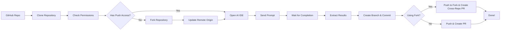

# SimulateDev

> Use cutting-edge AI IDEs such as Cursor and Windsurf as an API

SimulateDev is an automation tool that allows you to run AI coding agents (Cursor, Windsurf, Claude Code) on any GitHub repository with a custom prompt, and automatically create pull requests with the changes.

## Features

- **Multi-Agent Support**: Works with Cursor, Windsurf, and Claude Code (coming soon)
- **Automated Workflow**: Clone → Analyze → Implement → Create PR
- **Custom Prompts**: Send any coding task to your preferred AI agent
- **Visual UI Detection**: Uses Claude Computer Use for precise UI interaction
- **Auto Pull Requests**: Creates professional PRs with your changes
- **Local Execution**: Runs coding agents on your local machine

## How It Works



1. **Clone**: Downloads the specified GitHub repository
2. **Permission Check**: Automatically checks if you have push permissions
3. **Smart Workflow**: If no push access, automatically forks the repository
4. **Launch**: Opens your chosen AI coding agent (Cursor/Windsurf)
5. **Prompt**: Sends your custom coding task to the agent
6. **Monitor**: Watches the IDE interface to detect completion
7. **Commit**: Creates a new branch with the changes
8. **PR**: Creates pull request (cross-repository if using fork)

## Quick Start

### Prerequisites

- Python 3.8+
- Git installed and configured
- One of the supported AI IDEs installed:
  - [Cursor](https://cursor.com/)
  - [Windsurf](https://windsurf.ai/)
- API keys (see Setup section)

### Installation

1. **Clone the repository:**
   ```bash
   git clone https://github.com/your-username/simulatedev.git
   cd simulatedev
   ```

2. **Install dependencies:**
   ```bash
   pip install -r requirements.txt
   ```

3. **Set up environment variables:**
   ```bash
   cp env.example .env
   # Edit .env with your API keys
   ```

4. **Configure your API keys in `.env`:**
   ```env
   ANTHROPIC_API_KEY=your_anthropic_key_here
   GOOGLE_API_KEY=your_google_key_here
   GITHUB_TOKEN=your_github_token_here  # Optional, for PR creation
   ```

### Basic Usage

### General Coding Tasks

For custom coding tasks with user-defined prompts:

```bash
python main.py <repo_url> <prompt> <agent>
```

**Examples:**

```bash
# Fix responsive design issues with Cursor
python main.py https://github.com/user/repo "Fix responsive table design for mobile devices" cursor

# Add error handling with Windsurf  
python main.py https://github.com/user/repo "Add comprehensive error handling to API endpoints" windsurf

# Custom optimization task
python main.py https://github.com/user/repo "Optimize database queries" claude_code

# Test the pipeline and analyze codebase consistency
python main.py https://github.com/user/repo "Analyze codebase for inconsistencies" test
```

### Specialized Workflows

For predefined specialized workflows, use the workflows CLI:

```bash
python workflows_cli.py <workflow> <repo_url> <agent>
```

**Available Workflows:**

| Workflow | Description | Example |
|----------|-------------|---------|
| `bugs` | Find and fix bugs and security issues | `python workflows_cli.py bugs https://github.com/user/repo cursor` |
| `optimize` | Performance optimizations and improvements | `python workflows_cli.py optimize https://github.com/user/repo windsurf` |
| `refactor` | Code quality improvements and refactoring | `python workflows_cli.py refactor https://github.com/user/repo cursor` |
| `low-hanging` | Quick wins and easy improvements | `python workflows_cli.py low-hanging https://github.com/user/repo windsurf` |

**Examples:**

```bash
# Hunt for bugs and security issues
python workflows_cli.py bugs https://github.com/user/repo cursor

# Find performance optimization opportunities  
python workflows_cli.py optimize https://github.com/user/repo windsurf

# Improve code quality and maintainability
python workflows_cli.py refactor https://github.com/user/repo cursor

# Find easy wins and quick improvements
python workflows_cli.py low-hanging https://github.com/user/repo windsurf

# Skip pull request creation
python workflows_cli.py bugs https://github.com/user/repo cursor --no-pr
```

## Configuration

### API Keys Required

| Service | Purpose | Required | Get Key |
|---------|---------|----------|---------|
| Anthropic Claude | UI element detection | Yes | [Console](https://console.anthropic.com/) |  
| Google Gemini | IDE state analysis | Yes | [AI Studio](https://ai.google.dev/) |
| GitHub | Pull request creation | Optional | [Settings](https://github.com/settings/tokens) |

### Supported AI Agents

| Agent | Status | Notes |
|-------|--------|-------|
| Cursor | Supported | Full integration |
| Windsurf | Supported | Full integration |  
| Claude Code | Coming Soon | In development |
| Test | Supported | Pipeline testing & codebase analysis |

## Advanced Usage

### Smart Permission Handling

SimulateDev automatically handles repository permissions for you:

**Case 1: You have push permissions**
- Works directly on the original repository
- Creates branches and pull requests normally
- Fastest workflow, no forking needed

**Case 2: You don't have push permissions** 
- Automatically forks the repository to your GitHub account
- Makes changes in your fork
- Creates a cross-repository pull request from your fork to the original repo
- Completely transparent - you don't need to do anything different!

```bash
# Same command works for both cases
python main.py https://github.com/someone-else/repo "Fix bug" cursor
```

The tool will automatically:
1. Check your permissions on the target repository
2. Fork it if needed (only once - reuses existing forks)
3. Update git remotes to point to your fork
4. Create pull request from your fork back to the original repository

### Custom Target Directory

```bash
python main.py https://github.com/user/repo "Fix bugs" cursor --target-dir ~/my-projects/repo
```

### Skip Pull Request Creation

```bash
python main.py https://github.com/user/repo "Add features" windsurf --no-pr
```

### Test Agent

The Test Agent is a special agent designed for pipeline testing and codebase analysis. Unlike other agents that require UI interaction, the Test Agent performs automated analysis and is perfect for:

- **Pipeline Testing**: Verify that the entire SimulateDev pipeline works correctly
- **Codebase Analysis**: Identify inconsistencies in code structure and documentation
- **README Validation**: Check if documentation accurately reflects the current codebase
- **Quality Assurance**: Find missing headers, documentation, and registration issues

**Usage:**
```bash
# Run codebase analysis
python main.py https://github.com/user/repo "Analyze codebase for inconsistencies" test

# Test the pipeline without creating a PR
python main.py https://github.com/user/repo "Test pipeline functionality" test --no-pr

# You can also test locally using the demo script
python test_agent_demo.py
```

The Test Agent automatically checks for:
- Agent registration consistency in factory files
- README accuracy compared to available agents
- Missing file headers and documentation
- General code structure issues

### Environment Variables

You can also set environment variables directly:

```bash
export ANTHROPIC_API_KEY="your_key"
export GOOGLE_API_KEY="your_key" 
export GITHUB_TOKEN="your_token"
python main.py https://github.com/user/repo "Refactor code" cursor
```

## Development

### Project Structure

```
simulatedev/
├── main.py                       # Main CLI for general coding tasks
├── workflows_cli.py              # CLI for specialized workflows (bugs, optimize, etc.)
├── agent_orchestrator.py         # High-level agent workflow coordination  
├── workflows/                    # Specialized workflow modules
│   ├── __init__.py              # Package initialization
│   ├── bug_hunting.py           # Bug discovery and fixing workflows
│   ├── code_optimization.py     # Performance and refactoring workflows
│   └── general_coding.py        # General user-defined coding tasks
├── coding_agents.py             # Agent abstraction layer (Cursor, Windsurf, Claude Code)
├── clone_repo.py                # Repository cloning utilities
├── computer_use_utils.py        # Claude Computer Use integration
├── ide_completion_detector.py   # IDE state monitoring
├── github_integration.py        # GitHub API operations and PR creation
├── requirements.txt             # Dependencies
└── scanned_repos/              # Cloned repositories
```

### Module Responsibilities

- **`main.py`**: Entry point for general coding tasks with user-defined prompts
- **`workflows_cli.py`**: Entry point for specialized predefined workflows
- **`agent_orchestrator.py`**: High-level orchestration for agent workflows (IDE management, prompt sending, response handling)
- **`workflows/`**: Package containing specialized workflow modules:
  - **`bug_hunting.py`**: Bug discovery and security issue fixing
  - **`code_optimization.py`**: Performance optimizations, refactoring, and code quality improvements
  - **`general_coding.py`**: Enhanced general-purpose coding task handling
- **`coding_agents.py`**: Clean abstraction layer for different AI coding agents
- **`github_integration.py`**: Git operations and GitHub API integration
- **`computer_use_utils.py`**: Claude Computer Use for screen automation
- **`ide_completion_detector.py`**: Monitors IDE state to detect task completion

### Running Tests

```bash
# Test GitHub integration
python github_integration.py

# Test repository cloning
python clone_repo.py https://github.com/octocat/Hello-World

# Test computer use utilities
python computer_use_utils.py
```

## Contributing

1. Fork the repository
2. Create a feature branch: `git checkout -b feature/amazing-feature`
3. Commit your changes: `git commit -m 'Add amazing feature'`
4. Push to the branch: `git push origin feature/amazing-feature`
5. Open a Pull Request

## Roadmap

- [ ] **Claude Code Integration**: Add support for Google Cloud Code
- [ ] **Web Interface**: Build a web UI for easier usage
- [ ] **Batch Processing**: Process multiple repositories at once
- [ ] **Custom Agents**: Support for other AI coding tools
- [ ] **Docker Support**: Containerized execution
- [ ] **Webhooks**: GitHub webhook integration for automated triggers

## Troubleshooting

### Common Issues

**IDE doesn't open:**
- Ensure the IDE is installed and accessible from command line
- Check if the IDE is already running

**API key errors:**
- Verify your API keys in `.env` file
- Check API key permissions and quotas

**Pull request creation fails:**
- Ensure GitHub token has `repo` permissions
- For private repositories, token needs additional permissions
- If forking fails, check if the repository allows forking

**Permission issues:**
- If you don't have push permissions, the tool will automatically fork
- Ensure your GitHub token has `public_repo` permission (for public repos) or `repo` (for private repos)
- For organizations, you may need additional permissions to fork repositories

**UI element not found:**
- Try running with a clean IDE state
- Ensure the IDE window is visible and focused

### IDE-Specific Behaviors

**Cursor 25 Tool Call Limit (Auto-Handled):**
- Cursor automatically stops agents after 25 tool calls by default
- SimulateDev automatically detects this message and clicks "Resume the Conversation"
- No manual intervention required - the workflow continues seamlessly
- This only applies to Cursor - other agents run until completion

**Windsurf Trust Workspace:**
- May prompt to trust the workspace on first run
- SimulateDev automatically handles this prompt
- Ensure Windsurf has necessary permissions

## License

This project is licensed under the MIT License - see the [LICENSE](LICENSE) file for details.

## Acknowledgments

- [Anthropic Claude](https://anthropic.com/) for computer use capabilities
- [Google Gemini](https://ai.google.dev/) for image analysis
- [Cursor](https://cursor.com/) and [Windsurf](https://windsurf.ai/) for amazing AI coding experiences

---

**Built with love for the developer community**
